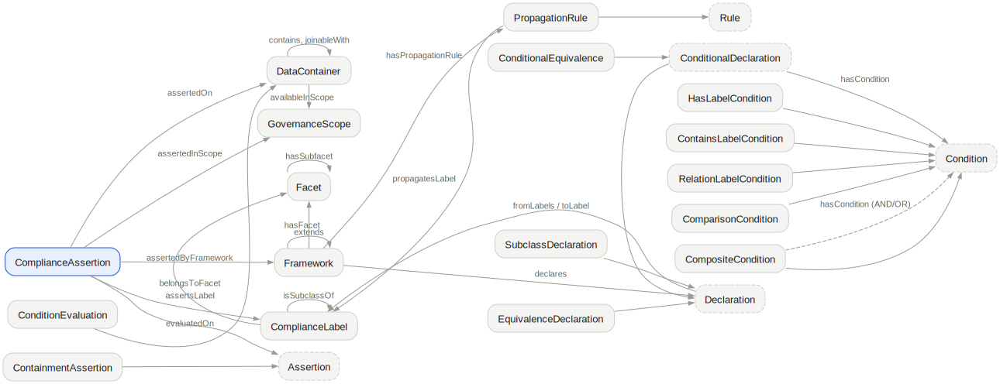

# Parajudica

Parajudica computes data compliance classifications across multiple compliance frameworks.



- **Code** [github.com/alfredr/parajudica](https://github.com/alfredr/parajudica)
- **Package** [pypi.org/project/parajudica](https://pypi.org/project/parajudica/)
- **Archive** [doi.org/10.5281/zenodo.17825089](https://doi.org/10.5281/zenodo.17825089)
- **Vocabulary** [parajudica.org/ns](/ns)
- **Registry** [parajudica.org/registry](/registry)
- **Contribute** [CONTRIBUTING.md](https://github.com/alfredr/parajudica/blob/main/CONTRIBUTING.md)

```bash
pip install parajudica
parajudica --help
```

## Contributing

The most useful contribution is a new framework module: a regulation or interpretation encoded as declarative rules, with a manifest citing the legal source it rests on. The [registry](/registry) indexes every module automatically. See [CONTRIBUTING](https://github.com/alfredr/parajudica/blob/main/CONTRIBUTING.md).

## About the name

*Parajudica* means parallel judgements: each framework's classification is held alongside the others rather than reconciled into one.

---

Luc Moreau (Sussex) &middot; Alfred Rossi (Immuta Research) &middot; Sophie Stalla-Bourdillon (VUB) &middot; vocabulary CC-BY-4.0
